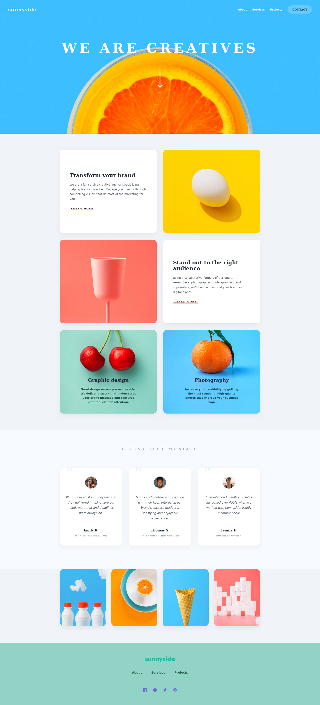
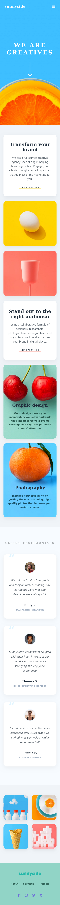

# Sunnyside Agency Landing Page

The Sunnyside Agency Landing Page is a modern and responsive website built as part of a Frontend Mentor challenge.

This project represents a digital agency landing page designed to showcase services, highlight client testimonials, and provide a clean and engaging user experience across all devices.

It was developed collaboratively using GitHub, with each team member responsible for specific sections of the application, following real-world development practices.

---

## Overview

### Project Description

This landing page simulates a real-world agency website. It focuses on:

- Presenting brand identity through a visually appealing hero section
- Showcasing services with structured content sections
- Displaying client testimonials to build credibility
- Providing intuitive navigation, especially on mobile devices
- Ensuring accessibility and responsive behavior across screen sizes

### The Challenge

Users should be able to:

- View the optimal layout for the site depending on their device's screen size
- See hover states for all interactive elements
- Navigate using a responsive mobile menu
- Experience accessible focus states for better usability

---

## Screenshot Desktop



## Screenshot Mobile



---

## Links

- Live Site URL: coming soon
- Repository URL: https://github.com/FreeDev-Group/agency-landing-page-by-Edouard

---

## Built With

- Semantic HTML5 markup
- CSS custom properties
- Flexbox & CSS Grid
- Mobile-first workflow
- Vanilla JavaScript

---

## Features

- Responsive design (Desktop & Mobile)
- Hamburger menu with toggle functionality
- Overlay navigation for mobile UX
- CTA button with hover effects
- Clean and modern UI
- Accessibility improvements (focus states)

---

## Team Collaboration

This project was developed collaboratively using GitHub.

Each contributor worked on specific issues:

- 1. Project Setup
- 2. Header & Navigation
- 3. Mobile Navigation (JS part)
- 4. Hero Section
- 5. Features / Services Section
- 6. Content Sections (Main Body)
- 7. Testimonials / Client Section (if present)
- 8. Footer
- 9. Responsiveness (Mobile + Tablet)
- 10. UI Polish & Accessibility
- Read me template update

We followed best practices such as:

- Working with feature branches
- Making scoped commits
- Avoiding merge conflicts
- Writing clean and maintainable code

---

## Project Structure

```
├── index.html
├── style.css
├── images
│── script.js
└── README.md
```

---

## What We Learned

- Collaborating effectively using GitHub
- Managing branches and pull requests
- Avoiding and resolving merge conflicts
- Writing scalable and clean CSS
- Improving accessibility in web interfaces

---

## Continued Development

In future improvements, we would like to:

- Add animations and transitions for better UX
- Improve accessibility to meet WCAG standards
- Optimize images for performance
- Convert the project into a reusable component-based structure

---

## Authors

- Built with collaboration and teamwork

  https://github.com/ElGautinho
  https://github.com/edouardkne
  https://github.com/Mugisho-dev-metasploit
  https://github.com/arnold722

---

## How to run locally

1. Clone this repository  
2. Open `index.html` in your browser  


## Acknowledgments

- Mentors challenge their mentees
- Frontend Mentor for providing the challenge
- Team members for their contributions and collaboration

---
